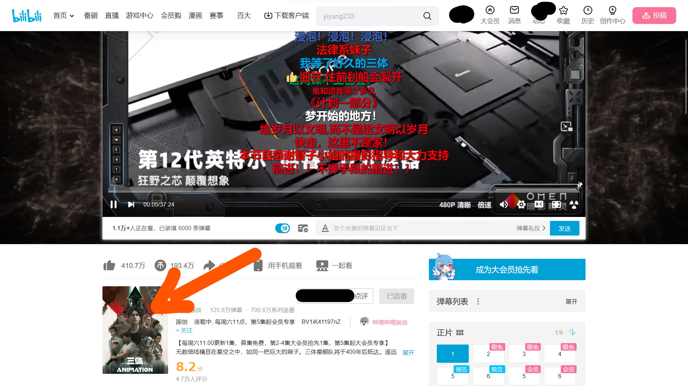
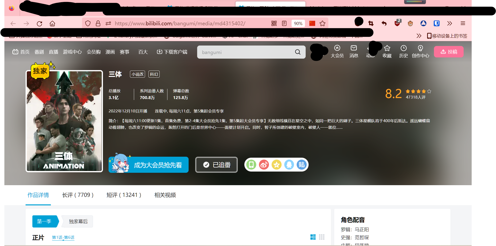

# 自动获取b站番剧真实评分
# 警告：此项目还在测试
## 创作初衷
这个世界上好的作品不多，有些作品也是烂的跟依托答辩一样，但是还是登顶了国创排行榜 **（点名异化三体）*(doge)*** 我们要做的就是揭开资本的伪装，了解他的真实

## 代码实现
1. 使用浏览器的开发者模式爬取Bilibili评论接口

        api.bilibili.com/pgc/review/short/list?media_id=(当前想要查询的id)&ps=30&sort=0
2. 编写代码

## 获取电影ID _(以三体举例)_
1.进入b站的搜索页面
2. 搜索你想要的电影名称
3. 进入观看
___
**_请确认你看到了如下的页面，并点击图中所指的位置_**

___
**_请确认你看到了如下的页面，现在请点击地址栏_**

___
**_请将"md"后面的一串数字复制下来作为id复制到软件中_**

___
## 使用
1. 不使用python
    1. 下载Release中的get.exe
    2. 输入电影的 id
    3. 耐心等待，当获取完成后会通知
## 当前BUG
- 无法获取数目较小的评论数据

## 愿想
- 多修点bug
- 多来点假期

## 后言
- 本人只是一位初中生，所以无法经常维护自己的项目，望见谅...